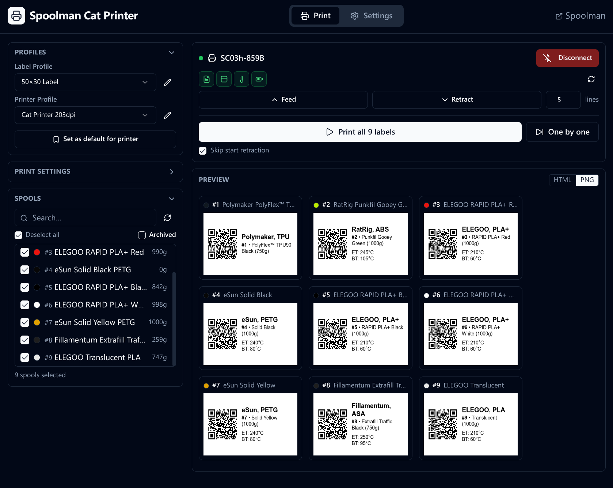

# Spoolman Cat Printer

A fully static web app for printing filament spool labels on Bluetooth thermal "
cat printers". Fetches spool data
from [Spoolman](https://github.com/Donkie/Spoolman), renders customizable labels
with QR codes, and sends them directly to the printer — no backend required.

It uses the Web Bluetooth API to communicate with the printer, which is
available only in Chromium-based browsers, such as Chrome and Edge.

 



## Features

- **Spoolman integration** — fetches live spool inventory over HTTP, searches
  and filters by name, material, vendor
- **Flexible label templates** — Handlebars + Markdown templates with full
  access to spool metadata
- **Three layouts** — text only, QR top / text bottom, QR left / text right
- **Multiple dithering algorithms** — Floyd-Steinberg (default), threshold,
  Bayer, dot-matrix
- **Landscape and unlimited-height labels** — portrait and landscape
  orientations, finite or roll-feed
- **Paper alignment** — automatic pre-advance, inter-label feed, and
  post-retract accounting for blade offset
- **Batch printing** — queue multiple spools, pause between labels, resume or
  cancel mid-job
- **WYSIWYG preview** — HTML preview (live DOM) and PNG preview (exact print
  bitmap), side by side
- **Profile system** — multiple label profiles and printer profiles, all
  persisted in localStorage
- **Fully offline-capable** — open `dist/index.html` directly from disk via
  `file://`

## Requirements

| Requirement | Notes                                                     |
|-------------|-----------------------------------------------------------|
| Browser     | Chrome, Edge, or Opera (Web Bluetooth API required)       |
| Printer     | AliExpress "cat printer" family (GB01, GB02, GB03, …)     |
| Spoolman    | Any reachable Spoolman instance (local network or remote) |

## Getting started

If you just want to use the app, head over to
the [GitHub Pages site](https://depau.github.io/spoolman-cat-printer/) and set
your Spoolman URL!

To build the app from source, follow these steps:

```bash
# Install dependencies
bun install          # or: npm install

# Development server with hot reload
bun run dev          # or: npm run dev

# Production build → dist/
bun run build        # or: npm run build

# Preview production build locally
bun run preview      # or: npm run preview
```

Open `http://localhost:5173` in Chrome/Edge. For a portable build, open
`dist/index.html` directly from disk.

## Usage

1. **Settings → Spoolman** — enter your Spoolman base URL and test the
   connection
2. **Settings → Label Profiles** — create or edit a label profile:
    - Set physical dimensions (width × height in mm, or unlimited height for
      roll feed)
    - Choose a layout and QR content
    - Write a Handlebars + Markdown template (
      see [Template reference](#template-reference) below)
    - Adjust font, line height, dithering, margins, and border
    - Live preview updates as you type
3. **Settings → Printer Profiles** — configure DPI, printable width, blade
   offset, and default speed/energy for your printer model
4. **Print page** — connect to the printer via Bluetooth, select spools from the
   list, and hit **Print**

## Template reference

Label templates are [Handlebars](https://handlebarsjs.com/) documents whose
output is parsed as Markdown. The full spool record from Spoolman is available
as template context.

### Available variables

| Variable                          | Type           | Description                           |
|-----------------------------------|----------------|---------------------------------------|
| `id`                              | number         | Spool ID                              |
| `spoolman_host`                   | string         | Spoolman base URL (no trailing slash) |
| `filament.name`                   | string         | Filament name                         |
| `filament.material`               | string         | e.g. `PLA`, `PETG`, `ASA`             |
| `filament.color_hex`              | string \| null | Color hex without `#`                 |
| `filament.vendor.name`            | string \| null | Vendor/brand name                     |
| `filament.settings_extruder_temp` | number \| null | Recommended nozzle temp               |
| `filament.settings_bed_temp`      | number \| null | Recommended bed temp                  |
| `remaining_weight`                | number \| null | Remaining filament in grams           |
| `used_weight`                     | number         | Used filament in grams                |
| `location`                        | string \| null | Storage location                      |
| `comment`                         | string \| null | Free-form comment                     |

All other fields from the [Spoolman API](https://github.com/Donkie/Spoolman) are
also available.

### Helpers

| Helper                          | Description                                                     |
|---------------------------------|-----------------------------------------------------------------|
| `{{#ifval value}}...{{/ifval}}` | Render block only if value is non-null, non-empty, and non-zero |
| `{{#eq a b}}...{{/eq}}`         | Render block only if `a === b`                                  |

### Example template

```handlebars
# {{filament.name}}
{{#ifval filament.vendor.name}}**{{filament.vendor.name}}**{{/ifval}}

**{{filament.material}}**{{#ifval
        filament.color_hex}} · #{{filament.color_hex}}{{/ifval}}

{{#ifval remaining_weight}}{{remaining_weight}}g remaining{{/ifval}}
{{#ifval
        filament.settings_extruder_temp}}Nozzle: {{filament.settings_extruder_temp}}°C{{/ifval}}
{{#ifval
        filament.settings_bed_temp}}Bed: {{filament.settings_bed_temp}}°C{{/ifval}}
```

### QR code content

The QR content field is also a Handlebars template. The default
`web+spoolman:s-{{id}}` produces a URI that Spoolman-aware apps can handle. You
can substitute a full URL, e.g.:

```
{{spoolman_host}}/spool/{{id}}
```

## Label profile options

| Option         | Description                                                       |
|----------------|-------------------------------------------------------------------|
| Width / Height | Physical label size in mm; height `null` = unlimited (roll feed)  |
| Orientation    | Portrait or landscape (landscape requires fixed height)           |
| Gap            | Space between labels on the roll, in mm                           |
| Margins        | Inner padding on each side, in mm                                 |
| Layout         | Text only / QR top + text bottom / QR left + text right           |
| QR scale       | Integer px per QR module — higher = larger, always pixel-perfect  |
| Style mode     | Easy (font/size/alignment controls) or Advanced (raw CSS)         |
| Dithering      | Floyd-Steinberg / threshold / Bayer / dot — affects print quality |
| Border         | Optional border drawn inside the label margins                    |

## Printer profile options

| Option          | Default  | Description                                            |
|-----------------|----------|--------------------------------------------------------|
| DPI             | 203      | Printer resolution                                     |
| Printable width | 384 px   | Maximum printable pixel columns                        |
| Blade offset    | 85 lines | Distance from cutting blade to print head, in dot rows |
| Speed           | 64       | Printer speed parameter sent before each job           |
| Energy          | 24000    | Thermal energy parameter (higher = darker)             |

## Paper alignment

For **fixed-height labels** the app automatically:

- advances paper so the print head lands on the first label start
- feeds one gap between each label
- retracts after the last label so the blade sits at the cut point

For **unlimited-height labels** instruct the printer to position the cutting
blade flush with the top edge of the first label before printing.

## Architecture

```
src/
├── lib/
│   ├── labelRenderer.ts    # HTML generation → html-to-image canvas → dithering → 1-bit bitmap
│   ├── templateEngine.ts   # Handlebars compilation, #ifval / #eq helpers, context builder
│   ├── printLoop.ts        # Async print loop with pause/cancel support
│   ├── paperAlignment.ts   # Pre-advance / inter-label / post-retract calculations
│   ├── qrGenerator.ts      # qrcode.toCanvas at integer scale
│   └── spoolmanApi.ts      # Spoolman REST client
├── store/
│   ├── settingsStore.ts    # Profiles, Spoolman URL — persisted to localStorage
│   ├── printerStore.ts     # Bluetooth connection state, hardware polling
│   └── printJobStore.ts    # Selected spools, job status, progress
├── components/
│   ├── LabelPreview.tsx    # HTML (zoom-scaled iframe) and PNG (canvas) previews
│   └── …
├── pages/
│   ├── PrintPage.tsx
│   └── settings/
│       ├── LabelProfileEditor.tsx
│       └── PrinterProfileEditor.tsx
└── types/
    ├── profiles.ts         # LabelProfile, PrinterProfile
    ├── spoolman.ts         # ISpool, IFilament, IVendor
    └── printer.ts          # ConnectionStatus, PrinterHardwareState
```

## Tech stack

| Layer           | Library                               |
|-----------------|---------------------------------------|
| Framework       | React 18 + TypeScript + Vite          |
| Styling         | Tailwind CSS v3 + Radix UI primitives |
| State           | Zustand with `persist` middleware     |
| Templates       | Handlebars.js                         |
| Markdown        | marked                                |
| QR codes        | qrcode                                |
| Label rendering | html-to-image                         |
| Printer SDK     | @opuu/cat-printer                     |

## License

MIT
